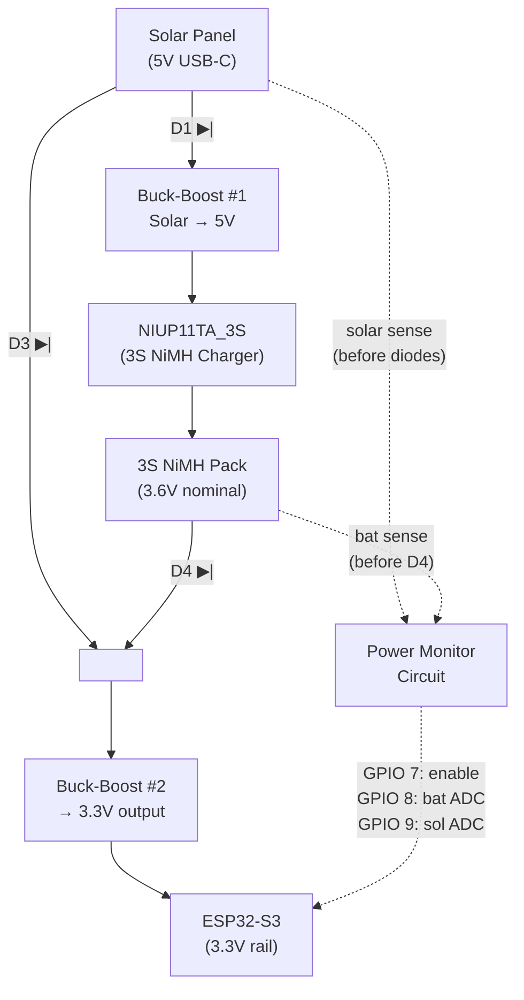

# Wiring Guide

Complete wiring reference for the ESP32 BirdNet Streamer, covering the I2S microphone, status LED, power monitoring circuit, and solar/battery power system.

## I2S Microphone

Most I2S MEMS microphones (INMP441, SPH0645, ICS-43434) have 6 pins. Connect them to the ESP32-S3 DevKitC as follows:


| Mic Pin | Function       | Wire   | ESP32-S3 GPIO | Notes                                                                       |
| --------- | ---------------- | -------- | --------------- | ----------------------------------------------------------------------------- |
| VDD     | Power          | Brown  | GPIO 10       | Powered from a GPIO pin (~1.4 mA). Do NOT use 5V — MEMS mics are 3.3V.     |
| GND     | Ground         | Black  | GND           |                                                                             |
| SCK     | Bit Clock      | Orange | GPIO 4        | Serial clock driven by ESP32                                                |
| WS      | Word Select    | Yellow | GPIO 5        | Frame/channel sync signal                                                   |
| SD      | Serial Data    | Red    | GPIO 6        | Audio data output from mic                                                  |
| L/R     | Channel select | Green  | GND           | Tie to GND for left channel, 3.3V for right channel. Code defaults to left. |

## Status LED

A standard red LED on GPIO 11 indicates system state during boot and operation.


| LED Pin      | Connect to | Notes                               |
| -------------- | ------------ | ------------------------------------- |
| Anode (+)    | GPIO 11    | Through a current-limiting resistor |
| Cathode (−) | GND        | Any GND pin on the ESP32-S3 DevKitC |

**Resistor selection:** Use a **330 Ω** resistor in series with the LED anode. This limits current to approximately 5 mA at 3.3V GPIO output (assuming a typical red LED forward voltage of 1.7V), which is bright enough to be visible without wasting power. A 220 Ω resistor also works if you want slightly brighter output (~7 mA).

```
ESP32-S3 GPIO 11 ───[ 330Ω ]───►|─── GND
                              (red LED)
```

### LED Flash Patterns


| Pattern                 | Meaning                                                              |
| ------------------------- | ---------------------------------------------------------------------- |
| One long flash (800 ms) | Boot success — WiFi connected via saved or compile-time credentials |
| Single flash every 5 s  | Captive portal active — waiting for WiFi configuration              |
| Double flash every 5 s  | WiFi connection failed (device will reboot)                          |
| Triple flash every 5 s  | I2S microphone initialization failed                                 |
| Off                     | System operating normally                                            |

## Power System

Solar-powered setup with 3S NiMH batteries, two buck-boost converters, and Schottky diode protection for reverse-current blocking.

### Overview



**Diode orientation** (current flows anode → cathode, band marks cathode):

- **D1:** Anode at solar panel (+), cathode at BB1 input. Allows current from solar to BB1; blocks reverse flow.
- **D3:** Anode at solar panel (+), cathode at BB2 input. Allows current from solar directly to BB2; blocks reverse flow.
- **D4:** Anode at battery pack (+), cathode at BB2 input. Allows battery to power BB2; blocks solar/BB2 from charging battery through this path.
- **Power Monitor:** Senses raw solar voltage (tapped *before* D1/D3) and battery voltage (tapped at battery pack +, before D4).

### Components


| Ref | Component            | Function                                                         |
| ----- | ---------------------- | ------------------------------------------------------------------ |
| BB1 | Buck-Boost Module #1 | Converts solar panel voltage to 5V for NiMH charging             |
| BB2 | Buck-Boost Module #2 | Converts battery (or direct solar) voltage to 3.3V for ESP32     |
| CHG | NIUP11TA_3S          | 3S NiMH charger module — charges pack from the 5V output of BB1 |
| D1  | Schottky Diode       | Blocks reverse current from BB1 back to solar panel              |
| D3  | Schottky Diode       | Blocks reverse current from BB2 back to solar on direct path     |
| D4  | Schottky Diode       | Blocks reverse current from BB2 input back into battery pack     |

### Power Paths

There are two paths to power the ESP32:

1. **Battery path:** Solar → D1 → BB1 (→5V) → NIUP11TA_3S → 3S NiMH → D4 → BB2 (→3.3V) → ESP32
2. **Direct solar path:** Solar → D3 → BB2 (→3.3V) → ESP32

The direct solar path allows the ESP32 to run directly from the solar panel when sun is available, reducing battery cycling and extending cell life. When both paths are active, BB2 draws from whichever input has higher voltage after the respective diode drops.

### Schottky Diode Placement & Purpose


| Diode | Location                   | Purpose                                                                        |
| ------- | ---------------------------- | -------------------------------------------------------------------------------- |
| D1    | Solar panel → BB1 input   | Prevents BB1 output from feeding back into the solar panel at night            |
| D3    | Solar panel → BB2 input   | Prevents BB2 output from feeding back to the solar panel; isolates direct path |
| D4    | NiMH pack (+) → BB2 input | Prevents current flowing from the direct solar path into the battery pack      |

**Why Schottky?** Schottky diodes have a low forward voltage drop (~0.2–0.4V) compared to standard silicon diodes (~0.7V). This minimizes power loss in the charging and supply paths, which matters in a solar-powered system where every millivolt counts.

**Recommended parts:** 1N5817 (1A, 20V) or SB140 (1A, 40V) — both common, cheap, and suitable for the current levels in this project (<500 mA).

### Identifying Anode & Cathode on Schottky Diodes

Current flows from **anode (+)** to **cathode (−)**. The diode blocks current in the reverse direction.

```
    Anode (+)           Cathode (−)
       │                    │
       ├────── ▶|───────────┤
       │     (band side)    │
       │                    │

Physical package (axial, e.g. 1N5817):

    ┌───────────────────────────────┐
    │          ███                  │
    │  (no band)  █ (silver/grey band) │
    └───┬───────────────────────┬───┘
        │                       │
     ANODE (+)              CATHODE (−)
   (current in)           (current out)
```

**How to identify:**

- **Band marking:** The silver or grey band printed on one end of the diode body marks the **cathode (−)**. Current flows *away* from the band.
- **Schematic symbol:** The triangle points from anode to cathode: `▶|` — the vertical bar is the cathode side.
- **Mnemonic:** The band looks like the flat bar in the schematic symbol `|`. Band = bar = cathode.

**Orientation in this circuit:**


| Diode | Anode connects to | Cathode connects to | Current direction allowed        |
| ------- | ------------------- | --------------------- | ---------------------------------- |
| D1    | Solar panel (+)   | BB1 input (+)       | Solar → BB1 (charging path)     |
| D3    | Solar panel (+)   | BB2 input (+)       | Solar → BB2 (direct ESP32 path) |
| D4    | 3S NiMH pack (+)  | BB2 input (+)       | Battery → BB2 (discharge path)  |

In all three cases: the **band (cathode) faces toward the buck-boost module input**. Solar/battery positive wire goes to the un-banded end.

### Buck-Boost Module #1: Solar → 5V (Charging)

- **Input:** Solar panel (variable, typically 4–7V from a USB-C panel)
- **Output:** 5V regulated
- **Purpose:** Provides a stable 5V rail for the NiMH charger module regardless of solar panel voltage fluctuations
- **Notes:** Any small adjustable buck-boost module works (e.g., MT3608-based). Set output to 5.0V with the trim pot.

### NiMH 3S Charger Module (NIUP11TA_3S)

- **Input:** 5V from BB1
- **Output:** Connected to 3S NiMH battery pack (3 × AA or 3 × AAA in series)
- **Type:** NIUP11TA_3S — dedicated 3S NiMH charger with proper charge termination
- **Notes:** Do NOT substitute a Li-Ion charger — NiMH requires different charge termination chemistry. The NIUP11TA_3S handles -ΔV detection for 3-cell series packs.

### Buck-Boost Module #2: Battery/Solar → 3.3V (ESP32 Power)

- **Input:** Battery voltage via D4 (3.0–4.5V) OR direct solar via D3 (4–7V minus diode drop)
- **Output:** 3.3V regulated
- **Purpose:** Powers the ESP32-S3 3.3V rail directly
- **Notes:** Must handle the full input range (2.8V depleted battery to ~6.5V solar). A buck-boost is required because battery voltage can drop below 3.3V. Feed into the ESP32's 3.3V pin directly, bypassing the onboard regulator.

### 3S NiMH Battery Pack

- **Configuration:** 3 cells in series (3S)
- **Voltage range:** 3.0V (depleted) to 4.5V (freshly charged)
- **Nominal:** 3.6V (1.2V × 3)
- **Recommended cells:** Eneloop or similar low-self-discharge NiMH AAs

### Wiring Connections

```
Solar Panel (+) ─────┬──── D1 anode
                     │
                     └──── D3 anode

D1 cathode ──────────────── BB1 input (+)
BB1 output (+) ──────────── NIUP11TA_3S input (+)
NIUP11TA_3S output (+) ──── 3S NiMH Pack (+)
NIUP11TA_3S output (−) ──── 3S NiMH Pack (−)

3S NiMH Pack (+) ─── D4 anode
D4 cathode ──────────┬───── BB2 input (+)
D3 cathode ──────────┘

BB2 output (+) ──────────── ESP32-S3 3.3V pin
BB2 output GND ──────────── ESP32-S3 GND

Solar Panel (−) ─────────── Common GND (shared with batteries, BB1, BB2, ESP32)
3S NiMH Pack (−) ────────── Common GND
```

### Design Notes

- **Diode drops:** Each Schottky diode drops ~0.3V. D1 is in the charging path (solar → BB1) and D4 is in the discharge path (battery → BB2). Account for D1's drop when setting BB1 output — the charger still receives close to 5V since BB1 regulates its output independently of the input drop.
- **Direct solar priority:** When the sun is up and solar voltage (after D3 drop) exceeds battery voltage (after D4 drop), BB2 draws primarily from solar. This is passive diode-OR behavior — no active switching needed.
- **Night operation:** When solar drops to 0V, D3 and D1 block any reverse flow. The battery supplies BB2 through D4, and the ESP32 runs from stored energy.
- **Deep sleep draw:** During deep sleep the ESP32-S3 draws ~7 µA. BB2's quiescent current (typically 10–50 µA for small modules) dominates. Total system sleep current is well under 100 µA.

## Power Measurement Circuit

Voltage monitoring for the 12V battery and solar panel input using always-on resistor dividers. The dividers draw ~58 µA continuously — negligible for a 12V system.

For full design rationale, calculations, calibration procedures, and troubleshooting, see [docs/power-monitor-circuit.md](power-monitor-circuit.md).

### How It Works

Two resistor voltage dividers are permanently connected between the voltage sources and ground. The divided voltages appear on GPIO 8 and GPIO 9 for the ESP32's ADC to read at any time. No switching is needed — the ~58 µA continuous draw is negligible for a 12V battery.

### Schematic

```
                   VBAT (+)              VSOLAR (+)
              (from 12V battery)    (from solar panel)
                     │                       │
                  ┌──┴──┐                 ┌──┴──┐
                  │ R1   │                 │ R3   │
                  │470kΩ │                 │680kΩ │
                  └──┬──┘                 └──┬──┘
                     │                       │
                     ├─── GPIO 8 (ADC)       ├─── GPIO 9 (ADC)
                     │                       │
                  ┌──┴──┐  ┌──┴──┐        ┌──┴──┐  ┌──┴──┐
                  │ R2   │  │ C1   │        │ R4   │  │ C2   │
                  │100kΩ │  │100nF │        │100kΩ │  │100nF │
                  └──┬──┘  └──┬──┘        └──┬──┘  └──┬──┘
                     │        │              │        │
                     └────┬───┘              └────┬───┘
                          │                       │
                         GND                     GND
```

### Parts List


| Ref | Part      | Value     | Purpose                                |
| ----- | ----------- | ----------- | ---------------------------------------- |
| R1  | Resistor  | 470kΩ    | Battery divider upper leg              |
| R2  | Resistor  | 100kΩ    | Battery divider lower leg              |
| R3  | Resistor  | 680kΩ    | Solar divider upper leg                |
| R4  | Resistor  | 100kΩ    | Solar divider lower leg                |
| C1  | Capacitor | 100nF     | ADC filter on GPIO 8                   |
| C2  | Capacitor | 100nF     | ADC filter on GPIO 9                   |

### Voltage Divider Ratios


| Channel | Upper     | Lower     | Ratio  | Example: input → ADC           |
| --------- | ----------- | ----------- | -------- | -------------------------------- |
| Battery | R1 470kΩ | R2 100kΩ | ÷ 5.7 | 12.8V → 2.25V, 14.8V → 2.60V |
| Solar   | R3 680kΩ | R4 100kΩ | ÷ 7.8  | 17V → 2.18V, 22V → 2.82V     |

All ADC values stay within the ESP32-S3's 0–3.1V range (11dB attenuation).

### Measurement Points (Where to Connect)

- **VBAT (+):** Connect to the **12V battery positive terminal** (same node as D4 anode)
- **VSOLAR (+):** Connect to the **solar panel positive wire** (before D1/D3, raw panel voltage)
- **GND:** Common ground shared with the rest of the system

### Wiring to ESP32

```
ESP32-S3 GPIO 8  ──── R1/R2 midpoint (battery ADC sense node)
ESP32-S3 GPIO 9  ──── R3/R4 midpoint (solar ADC sense node)
ESP32-S3 GND     ──── R2 bottom, R4 bottom, C1 bottom, C2 bottom
```

## Complete GPIO Pin Assignment

All ESP32-S3 GPIOs used in this project:


| GPIO  | Function       | Direction | Color  | Subsystem      | Notes                                                     |
| ------- | ---------------- | ----------- | -------- | ---------------- | ----------------------------------------------------------- |
| RESET |                |           | Yellow |                |                                                           |
| 4     | I2S_SCK (BCLK) | OUTPUT    | Blue | I2S Microphone | Bit clock to INMP441                                      |
| 5     | I2S_WS (LRCLK) | OUTPUT    | Yellow  | I2S Microphone | Word select / frame sync                                  |
| 6     | I2S_SD (DOUT)  | INPUT     | White   | I2S Microphone | Serial audio data from mic                                |
| 8     | VBAT_SENSE     | ADC INPUT | Purple | Power Monitor  | Battery voltage via divider (ADC1_CH7, 11dB atten)        |
| 9     | VSOL_SENSE     | ADC INPUT | Green  | Power Monitor  | Solar panel voltage via divider (ADC1_CH8, 11dB atten)    |
| 10    | MIC_POWER      | OUTPUT    | Orange | I2S Microphone | Powers INMP441 VDD (~1.4 mA, software-controlled)         |
| 11    | STATUS_LED     | OUTPUT    | Yellow | Status LED     | Red LED via 330Ω resistor — boot/error flash patterns   |

### Pin Selection Rationale

- **GPIOs 4–6** — I2S peripheral pins, grouped sequentially for clean routing.
- **GPIOs 8–9** — ADC1 channels (CH7, CH8). ADC1 remains usable when WiFi is active (ADC2 is not). 11dB attenuation gives 0–3.1V input range.
- **GPIO 10** — Mic power. Allows software power-cycling of the INMP441 and draws zero current during deep sleep (pin goes Hi-Z).
- **GPIO 11** — Status LED. General-purpose output driving a red LED through a 330Ω resistor. Draws ~5 mA only while flashing; off during normal operation and deep sleep.
- All selected pins are general-purpose on the ESP32-S3-DevKitC-1 (N16R8) with no conflicting boot-strapping or flash functions.

## Wiring Diagram (Text)

```
ESP32-S3 DevKitC              I2S MEMS Mic
─────────────────             ────────────
GPIO 10 ──────────────────────  VDD  ← powered from GPIO
GND   ────────────────────────  GND
GPIO 4 ───────────────────────  SCK
GPIO 5 ───────────────────────  WS
GPIO 6 ───────────────────────  SD
GND   ────────────────────────  L/R  ← left channel

                              Status LED
                              ──────────
GPIO 11 ──[ 330Ω ]──►|──────  GND  (red LED, anode to resistor)

                              Power Monitor
                              ─────────────
GPIO 8  ──────────────────────  R1/R2 midpoint (battery sense)
GPIO 9  ──────────────────────  R3/R4 midpoint (solar sense)
GND     ──────────────────────  R2 bottom, R4 bottom
```

## Tips

- Keep wires short (< 10 cm) to avoid noise on the I2S clock lines.
- Add a 100 nF decoupling capacitor between VDD and GND as close to the mic as possible.
- If you hear silence, double-check that L/R (SEL) is tied to GND (left) — the firmware reads the left channel only.
- To use the right channel instead, change `I2S_CHANNEL_FMT_ONLY_LEFT` to `I2S_CHANNEL_FMT_ONLY_RIGHT` in `main.cpp` and tie L/R to 3.3V.
- The pin assignments can be changed by editing the `I2S_WS_PIN`, `I2S_SD_PIN`, and `I2S_SCK_PIN` defines at the top of `main.cpp`.
